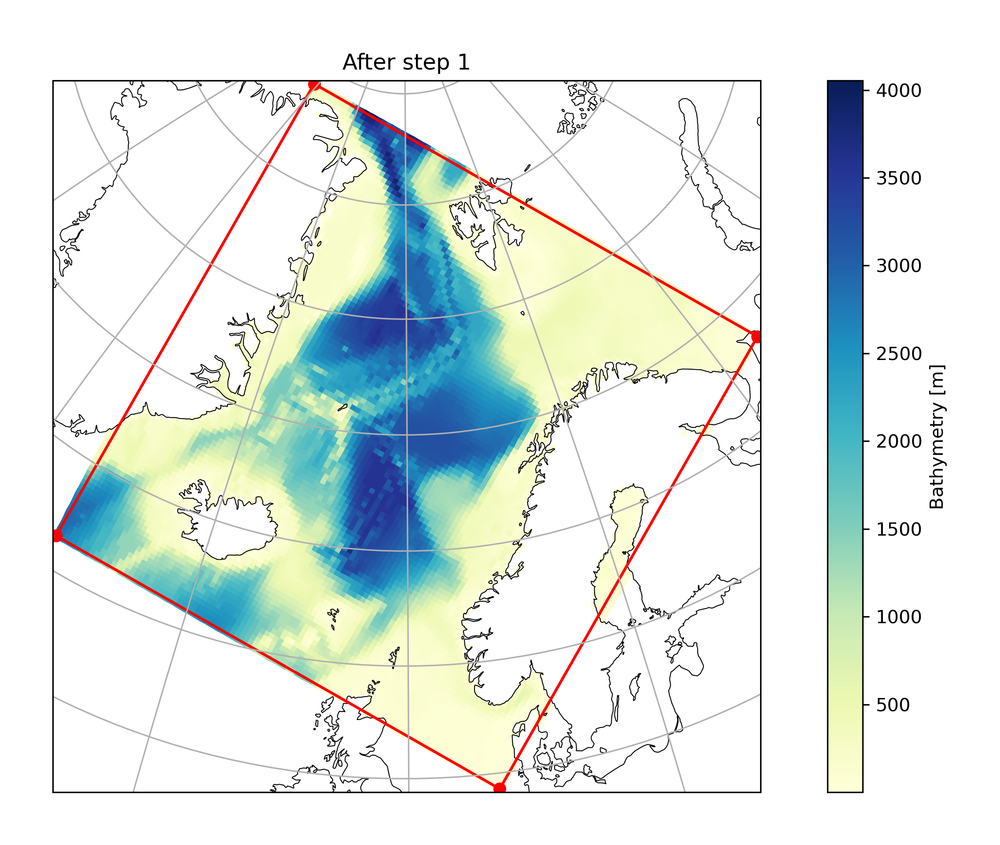
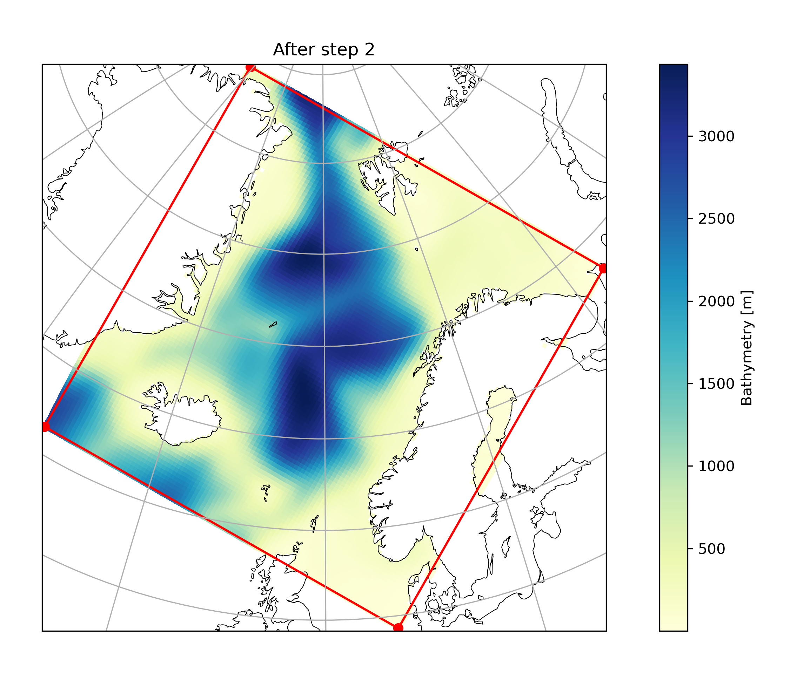
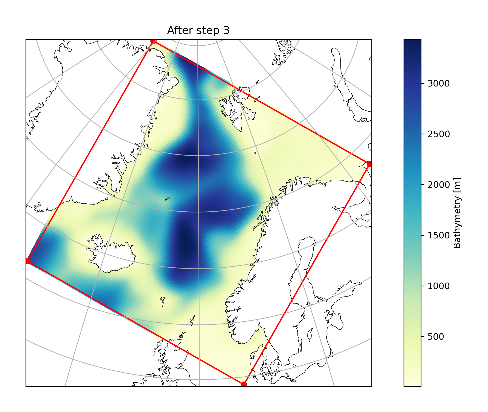
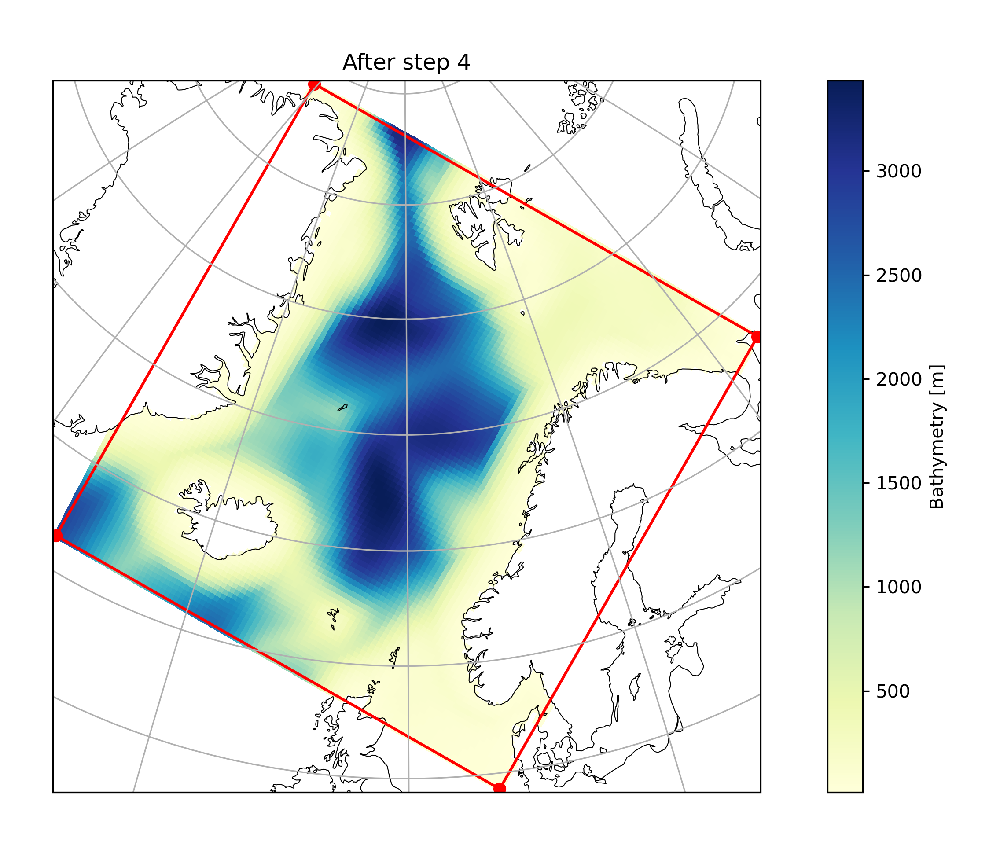

# Methodology

The ROMS-Tools methodology closely follows the methods employed in the [UCLA MATLAB tools](https://github.com/nmolem/ucla-tools/tree/main).

## Horizontal Grid

The horizontal grid is generated by creating an instance of the `roms_tools.Grid` class. For practical examples, see [this notebook](grid.ipynb).

The horizontal grid parameters are as follows:

| Parameter    | Description                                                       | Unit                        |
|--------------|-------------------------------------------------------------------|-----------------------------|
| `nx`         | Number of points in the x-direction (excluding 2 boundary cells)   | -                           |
| `ny`         | Number of points in the y-direction (excluding 2 boundary cells)   | -                           |
| `size_x`     | Size of the domain in the x-direction                             | km                          |
| `size_y`     | Size of the domain in the y-direction                             | km                          |
| `center_lon` | Longitude of the center of the domain                             | Degrees                     |
| `center_lat` | Latitude of the center of the domain                              | Degrees                     |
| `rot`        | Rotation of the grid's x-direction from lines of constant longitude | Degrees (counter-clockwise) |

To generate the horizontal grid from these parameters, `ROMS-Tools` follows a series of steps to define the domain and coordinate system:

- Given the `size_x` and `size_y` parameters, the domain is initially oriented to prioritize the x-direction as longer than the y-direction. This may involve swapping `size_x` with `size_y` and `nx` with `ny`. This step is performed to minimize grid distortion.
- `nx + 2` grid points are spaced uniformly in longitude.
- A Mercator projection is applied across the equator to convert latitude degrees into y-coordinates. `ny + 2` grid points are spaced uniformly in the y-coordinate. An inverse Mercator projection is then performed to return to geographic coordinates.
- If there was a swap in step 1, the grid is now rotated by 90 degrees back to its original orientation.
- The coordinate system is rotated by the specified angle `rot` to align with the desired orientation.
- Coordinates are translated to center the grid at the specified longitude `center_lon` and latitude `center_lat`.
- Grid metrics `pm = 1/dx` and `pn = 1/dy` are computed, where `dx` and `dy` represent the grid spacing in the x and y directions, respectively.
- The angle between the positive x-axis of the local grid and East is computed to establish the orientation relative to geographic directions.

## Topography and Mask

During the grid generation process, when an instance of the `roms_tools.Grid` class is created, `ROMS-Tools` also generates a topography field and a land mask. For practical examples, refer to [this notebook](grid.ipynb).

The topography field parameters are as follows:

| Parameter            | Description                                               | Unit |
|----------------------|-----------------------------------------------------------|------|
| `topography_source`   | Data source for the topography                            | -    |
| `h_min`               | Minimum ocean depth, strictly greater than zero           | m    |

The topography and mask are generated via the following steps:

1. **Regridding**: The topography from the specified `topography_source` is regridded onto the ROMS grid.
2. **Mask Definition**: The mask is defined using the regridded topography from step 1. At each grid point, topography values smaller than 0.0 meters are classified as land, and values larger than 0.0 meters are classified as ocean.
3. **Filling Enclosed Basins**: The mask is modified by filling enclosed basins with land.
4. **Domain-wide Smoothing**: The regridded topography from step 1 is smoothed over the entire domain with a smoothing factor of 8. This step ensures that the topography is smooth at the grid scale, a prerequisite for avoiding grid-scale instabilities during model runtime.
5. **Local Smoothing**: The topography field `h` is then smoothed locally such that the maximum slope parameter `r` is smaller than 0.2. The maximum slope parameter is given by

   $$ r = \max \left( \frac{|\Delta_x h|}{2h}, \frac{|\Delta_y h|}{2h} \right) $$

   The local smoothing in this step modifies the topography predominantly along the continental shelf.

6. **Depth Clipping**: Regions where the ocean depth is shallower than `h_min` are set to `h_min`. The rationale behind this step is to ensure that tidal excursion does not exceed the water depth at runtime. Since ROMS currently does not support wetting or drying, the model will crash if the water depth becomes negative.

Here are these steps illustrated for an example domain:

## Vertical Coordinate System

ROMS uses a terrain-following vertical coordinate system. The vertical coordinate system is important for `ROMS-Tools` while creating input fields that have a depth dimension, such as the initial conditions or the boundary forcing, and therefore has to mimic the vertical coordinate system that is internally computed by ROMS. The vertical coordinate system parameters are as follows:

| Parameter                     | Description                                                | Unit |
|-------------------------------|------------------------------------------------------------|------|
| `N`                            | Number of vertical layers                                  | -    |
| `0 < θ_s ≤ 10`                 | Surface control parameter                                  | -    |
| `0 < θ_b ≤ 4`                  | Bottom control parameter                                   | -    |
| `h_c`                          | Critical depth                                             | m    |

Following [Shchepetkin and McWilliams (2009)](https://www.sciencedirect.com/science/article/pii/S0022103108001483) (see also Figure 2 in [Lemarie et al. (2012)](https://journals.ametsoc.org/view/journals/phoc/42/10/2012jpo03631.1.xml)), these parameters are used to create the vertical coordinate system as follows:

1. Introduction of a vertical stretched coordinate `σ(k)` ranging from `-1 ≤ σ ≤ 0`:

   $$
   \sigma(k) =
   \begin{cases}
      \frac{k-N}{N} & \text{at vertical w-points}, & k=0,\ldots,N \\
      \frac{k-N-0.5}{N} & \text{at vertical rho-points}, & k=1,\ldots,N
   \end{cases}
   $$

2. Computation of a vertical stretching function through a series of two refinement functions:

   $$
   C(\sigma) = \frac{1-\cosh(\theta_s \sigma)}{\cosh(\theta_s)-1}
   $$

   $$
   C(\sigma) = \frac{\exp(\theta_b C(\sigma))-1}{1-\exp(-\theta_b)}
   $$

   The first equation corresponds to the surface refinement function, while the second describes the bottom refinement function. `C(σ)` is a non-dimensional, monotonic function ranging from `-1 ≤ C(σ) ≤ 0`.

3. Computation of the layer and interface depths:

   $$
   z(x,y,\sigma,t) = \zeta(x,y,t) + (\zeta(x,y,t) + h(x,y)) \cdot S(x,y,\sigma)
   $$

   with the nonlinear vertical transformation functional `S(x,y,σ)` given by

   $$
   S(x,y,\sigma) = \frac{hc \cdot \sigma + h(x,y) \cdot C(\sigma)}{hc + h(x,y)}
   $$

Here, `ζ(x,y,t)` is the time-varying sea surface height, and `h(x,y)` is the unperturbed water column thickness, given by the topography. `z = -h(x,y)` corresponds to the ocean bottom.

`ROMS-Tools` executes steps 1 and 2 during the grid generation process, when an instance of the `roms_tools.Grid` class is created. Step 3 is executed when needed, during the creation of the initial conditions and boundary forcing. While executing step 3, `ROMS-Tools` assumes `ζ(x,y,t) = 0`, i.e., zero sea surface height.

## Tidal Forcing

Coming soon...

## Surface Forcing

Coming soon...

## Initial Conditions

*The initial conditions are created under the assumption of zero sea surface height.*

Coming soon...

## Boundary Forcing

*The initial conditions are created under the assumption of zero sea surface height.*

Coming soon...
