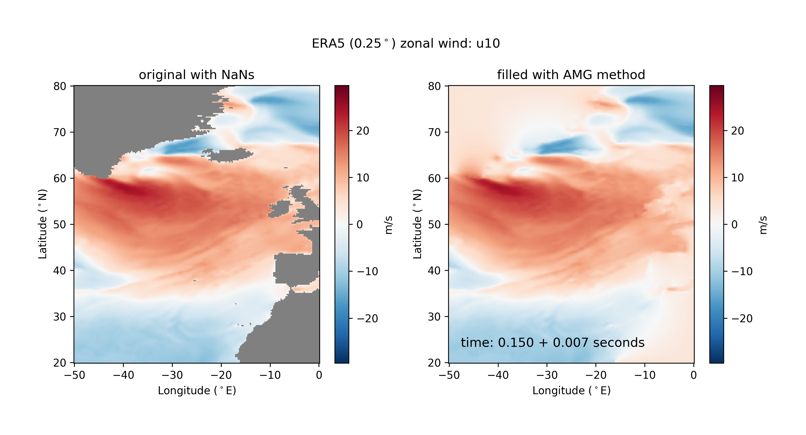
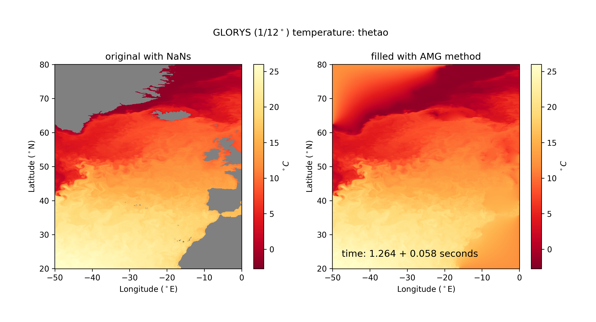

# Methodology

The ROMS-Tools methodology closely follows the methods employed in the [UCLA MATLAB tools](https://github.com/nmolem/ucla-tools/tree/main).

## Horizontal Grid

The horizontal grid is generated by creating an instance of the {py:obj}`roms_tools.Grid` class. For practical examples, see [this notebook](grid.ipynb).

The horizontal grid parameters are as follows:

| Parameter    | Description                                                       | Unit                        |
|--------------|-------------------------------------------------------------------|-----------------------------|
| `nx`         | Number of points in the x-direction (excluding 2 boundary cells)   | -                           |
| `ny`         | Number of points in the y-direction (excluding 2 boundary cells)   | -                           |
| `size_x`     | Size of the domain in the x-direction                             | km                          |
| `size_y`     | Size of the domain in the y-direction                             | km                          |
| `center_lon` | Longitude of the center of the domain                             | Degrees                     |
| `center_lat` | Latitude of the center of the domain                              | Degrees                     |
| `rot`        | Rotation of the grid's x-direction from lines of constant longitude | Degrees (counter-clockwise) |

Using these parameters, `ROMS-Tools` generates a curvilinear orthogonal grid designed to minimize variations in grid cell size across the domain. To achieve this, `ROMS-Tools` employs a Transverse Mercator projection.

**Detailed Steps**:

1. **Domain Orientation**: Given the `size_x` and `size_y` parameters, the domain is initially oriented to prioritize the x-direction as longer than the y-direction. This may involve swapping `size_x` with `size_y` and `nx` with `ny`. This step is performed to minimize grid distortion.

2. **Longitude Grid Points**: `nx` + 2 grid points are spaced uniformly in longitude.

3. **Mercator Projection**: A Mercator projection is applied across the equator to convert latitude degrees into y-coordinates. `ny` + 2 grid points are spaced uniformly in the y-coordinate. An inverse Mercator projection is then performed to return to geographic coordinates.

4. **Grid Rotation Back to Original Orientation**: If there was a swap in step 1, the grid is now rotated by 90 degrees back to its original orientation.

5. **Coordinate System Rotation**: The coordinate system is rotated by the specified angle `rot` to align with the desired orientation.

6. **Grid Centering**: Coordinates are translated to center the grid at the specified longitude `center_lon` and latitude `center_lat`.

7. **Grid Metrics Computation**: Grid metrics `pm = 1 / dx` and `pn = 1 / dy` are computed, where `dx` and `dy` represent the grid spacing in the x and y directions, respectively.

8. **Angle computation**: The angle between the positive x-axis of the local grid and East is computed to establish the orientation relative to geographic directions.


## Mask

During the grid generation process, when an instance of the {py:obj}`roms_tools.Grid` class is created, `ROMS-Tools` also generates a land mask. For practical examples, refer to [this notebook](grid.ipynb).

The mask is generated via the following two steps:

1. **Mask Definition**: The mask is generated by comparing the latitude and longitude coordinates of the horizontal grid with the [Natural Earth](https://www.naturalearthdata.com/) coastline dataset, which is provided at a high-resolution scale of 1:10m. This process is carried out using the [regionmask](https://regionmask.readthedocs.io/en/stable/) package.

2. **Filling Enclosed Basins**: The mask is modified by filling enclosed basins with land.

## Topography

During the grid generation process, when an instance of the {py:obj}`roms_tools.Grid` class is created, `ROMS-Tools` also generates a topography field. For practical examples, refer to [this notebook](grid.ipynb).

The topography field parameters are as follows:

| Parameter            | Description                                           | Unit | Constraint         |
|----------------------|-------------------------------------------------------|------|---------------------|
| `topography_source`   | Data source for the topography                        | -    | -                   |
| $h_{min}$               | Minimum ocean depth                                   | m    | $h_{min} > 0$


The topography is generated via the following steps:

1. **Regridding**: The topography from the specified `topography_source` is regridded onto the ROMS grid.
2. **Domain-wide Smoothing**: The regridded topography is smoothed over the entire domain with a smoothing factor of 8. This step is carried out using the [GCM-Filters](https://gcm-filters.readthedocs.io/en/latest/) package, and ensures that the topography is smooth at the grid scale, a prerequisite for avoiding grid-scale instabilities during model runtime.
3. **Depth Clipping**: In regions that correspond to land or where the ocean depth is shallower than $h_{min}$, the depth is clipped to $h_{min}$.
4. **Local Smoothing**: The regridded, clipped, and smoothed topography field `h` undergoes further local (logarithmic) smoothing to limit the slope parameter `r` to a maximum value of 0.2. This step helps minimize pressure gradient errors. The slope parameter is calculcated as:

$$

     r = \max \left( \frac{|\Delta_x h|}{2h}, \frac{|\Delta_y h|}{2h} \right)

$$
where $\Delta_x h$ and $\Delta_y h$ are the changes in depth along the x- and y-directions, respectively. This step modifies the topography predominantly along the continental shelf.

5. **Depth Clipping (Again)**: Depth values are once again clipped to $h_{min}$ in regions where the ocean depth falls below this threshold. The rationale behind this step is to ensure that tidal excursion does not exceed the water depth at runtime. Since ROMS currently does not support wetting or drying, the model will crash if the water depth becomes negative.

Here are the main steps illustrated for an example domain that covers the Nordic seas and has a horizontal resolution of 10 km:


Although the changes from the local smoothing are subtle, they are noticeable along the coastline south of Iceland.

## Vertical Coordinate System

ROMS uses a terrain-following vertical coordinate system. The vertical coordinate system is important for `ROMS-Tools` while creating input fields that have a depth dimension, such as the initial conditions or the boundary forcing, and therefore has to mimic the vertical coordinate system that is internally computed by ROMS. The vertical coordinate system parameters are as follows:

| Parameter                     | Description                                                | Unit | Constraint             |
|-------------------------------|------------------------------------------------------------|------|-------------------------|
| $N$                            | Number of vertical layers                                  | -    | -                       |
| $\theta_s$                          | Surface control parameter                                  | -    | $0 < \theta_s ≤ 10$          |
| $\theta_b$                          | Bottom control parameter                                   | -    | $0 < \theta_b ≤ 4$
| $h_c$                          | Critical depth                                             | m    | -                       |

Following {cite}`shchepetkin_correction_2009` (see also Figure 2 in {cite}`lemarie_are_2012`), these parameters are used to create the vertical coordinate system as follows:

1. **Vertical Coordinate**: A vertical stretched coordinate $\sigma(k)$ ranging from $-1 ≤ \sigma ≤ 0$ is defined as:

   $$
   \sigma(k) =
   \begin{cases}
      \frac{k-N}{N} & \text{at vertical w-points}, & k=0,\ldots,N \\
      \frac{k-N-0.5}{N} & \text{at vertical rho-points}, & k=1,\ldots,N
   \end{cases}
   $$

2. **Vertical Stretching Functions**: The vertical stretching function is computed through a series of two refinement functions:

   $$
   C(\sigma) = \frac{1-\cosh(\theta_s \sigma)}{\cosh(\theta_s)-1}
   $$

   $$
   C(\sigma) = \frac{\exp(\theta_b C(\sigma))-1}{1-\exp(-\theta_b)}
   $$

   The first equation corresponds to the surface refinement function, while the second describes the bottom refinement function. $C(\sigma)$ is a non-dimensional, monotonic function ranging from $-1 ≤ C(\sigma) ≤ 0$.

3. **Layer Depths**: The layer and interface depths are computed as:

   $$
   z(x,y,\sigma,t) = \zeta(x,y,t) + (\zeta(x,y,t) + h(x,y)) \cdot S(x,y,\sigma)
   $$

   with the nonlinear vertical transformation functional $S(x,y,\sigma)$ given by

   $$
   S(x,y,\sigma) = \frac{h_c \cdot \sigma + h(x,y) \cdot C(\sigma)}{h_c + h(x,y)}
   $$

Here, $\zeta(x,y,t)$ is the time-varying sea surface height, and $h(x,y)$ is the unperturbed water column thickness, given by the topography. $z = -h(x,y)$ corresponds to the ocean bottom.

Example plots of the vertical stretching functions and layer depths can be found [here](grid.ipynb#The-vertical-coordinate-system).

`ROMS-Tools` executes steps 1 and 2 during the grid generation process, when an instance of the {py:obj}`roms_tools.Grid` class is created. Step 3 is executed when needed, during the creation of the initial conditions and boundary forcing.

During step 3, `ROMS-Tools` handles sea surface height (SSH) based on the value of `adjust_depth_for_sea_surface_height`:

* If `adjust_depth_for_sea_surface_height = False` (default), a constant sea surface height is assumed: $\zeta(x,y,t) = 0$.
* If `adjust_depth_for_sea_surface_height = True`, the depth calculations account for spatial and temporal variations in SSH.

Setting `adjust_depth_for_sea_surface_height = True` increases the complexity in the depth coordinate generation, as depths become time-dependent. While this approach may seem more accurate, its effectiveness depends on how source datasets (e.g., GLORYS) define their depth coordinates. It is often unclear whether these datasets measure depth relative to the surface (consistent with `adjust_depth_for_sea_surface_height = False`) or elevation above the bottom (consistent with `adjust_depth_for_sea_surface_height = True`). Given this uncertainty and the unclear benefit of adjusting for sea surface height variations, the default setting is `adjust_depth_for_sea_surface_height = False` for simplicity.


## Tidal Forcing

The tidal forcing data is sourced from the 1/6$^\circ$ **TPXO** atlas, which is based on {cite}`egbert_efficient_2002`. The TPXO data undergoes two key corrections:

- **Self-Attraction and Loading (SAL) Correction**: The self-attraction and loading effects are subtracted from the equilibrium tide to derive the tidal potential. This correction accounts for the Earth's deformation and the redistribution of mass in the ocean due to the gravitational pull of the tides.

- **Phase and Amplitude Correction**: The tidal potential, tidal elevation, and tidal velocities are adjusted to align with the model's reference date, which may differ from that of the TPXO dataset. This adjustment includes phase correction and amplitude scaling to ensure accurate tidal representation.

After these corrections, the corrected data is regridded onto the ROMS grid, via the following steps:

1. **Horizontal Land Fill**: Ocean values are extended into land areas using a horizontal fill process based on a [multigrid method](#multigrid-method-for-filling-land-values). This step is important because the TPXO and ROMS grids may have differing land masks, particularly when their resolutions differ. Without applying the horizontal fill, land mask discrepancies could result in zero values at certain ocean points in the ROMS grid, where the TPXO data considers them land.
2. **Horizontal Regridding**: The horizontally filled TPXO data is then **linearly** regridded onto the ROMS grid.

```{warning}
It’s important to note that the tidal velocities are treated as two independent scalar fields-—zonal and meridional components—-during both steps 1 and 2, rather than as a vector field. This approach could potentially introduce artifacts.
```

3. **Rotation of Velocities**: The tidal velocities are rotated onto the ROMS grid to align with its orientation.
4. **Computation of barotropic velocities**: The rotated velocities are then divided by the ocean depth to convert tidal transport into tidal barotropic velocities. These barotropic velocities are then interpolated from rho-points to u- and v-points.

As a result of these processes, the following field pairs are produced on the ROMS grid, each consisting of real and imaginary components:

- **Tidal Elevation** (m): `ssh_Re`, `ssh_Im`
- **Tidal Potential** (m): `pot_Re`, `pot_Im`
- **Tidal Barotropic Velocities** (m/s): `u_Re`, `u_Im`, `v_Re`, `v_Im`

For practical examples, see [this notebook](tides.ipynb).

## Surface Forcing

The surface forcing data is sourced from **ERA5** (for meteorological forcing) and **CESM** (for biogeochemical surface forcing). The data is regridded onto the ROMS grid via the following steps:

1. **Horizontal Land Fill**: Ocean values are extended into land areas using a horizontal fill process based on a [multigrid method](#multigrid-method-for-filling-land-values). This step is crucial because the ERA5/CESM and ROMS grids may have differing land masks, especially when their resolutions differ. Without applying the horizontal fill, land mask discrepancies could result in skewed values at certain ocean points in the ROMS grid that the ERA5/CESM data considers land. Surface forcing over land differs significantly from surface forcing over the ocean, making the horizontal land fill essential.
2. **Horizontal Regridding**: The horizontally filled surface forcing data is then regridded onto the ROMS grid using **linear** interpolation.

```{warning}
It’s important to note that the 10m wind components are treated as two independent scalar fields-—zonal and meridional components—-during both steps 1 and 2, rather than as a vector field. This approach could potentially introduce artifacts.
```
3. **Rotation of Wind Velocities**: The 10m wind components are rotated onto the ROMS grid to align with its orientation.
4. **Radiation Correction**: If specified, shortwave radiation is corrected. It is widely recognized that global data products like ERA5 can have biases in radiation due to uncertain cloud-radiative feedbacks. `ROMS-Tools` includes functionality to correct for these biases. If `correct_radiation = True`, a multiplicative correction factor is applied to the ERA5 shortwave radiation. The correction factors have been pre-computed based on the differences between ERA5 climatology and the COREv2 climatology.

As a result of these processes, the following fields are produced on the ROMS grid:

Meteorological forcing fields:

- **Downward short-wave radiation** (W/m$^2$): `swrad`
- **Downward long-wave radiation** (W/m$^2$): `lwrad`
- **Air temperature at 2m** ($^\circ$C): `Tair`
- **Absolute humidity at 2m** (kg/kg): `qair`
- **Total precipitation** (cm/day): `rain`
- **10m wind in x-direction** (m/s): `uwnd`
- **10m wind in y-direction** (m/s): `vwnd`

Biogeochemical (BGC) forcing fields, compatible with ROMS-MARBL:

- **Atmospheric pCO2** (ppmv): `pco2_air`
- **Atmospheric pCO2, alternative CO2** (ppmv): `pco2_air_alt`
- **Iron decomposition** (nmol/cm$^2$/s): `iron`
- **Dust decomposition** (kg/m$^2$/s): `dust`
- **NOx decomposition** (kg/m$^2$/s): `nox`
- **NHy decomposition** (kg/m$^2$/s): `nhy`


For practical examples, see [this notebook](surface_forcing.ipynb).

## Initial Conditions

The initial conditions data is sourced from **GLORYS** (for physical fields) and **CESM** (for biogeochemical fields). The data is regridded onto the ROMS grid via the following steps:

1. **Extrapolation to Depth**: Values are extrapolated to depth by propagating the deepest available value down to the bottom.
2. **Horizontal Land Fill**: Ocean values are extended into land areas using a horizontal fill process based on a [multigrid method](#multigrid-method-for-filling-land-values). This step is crucial because the GLORYS/CESM and ROMS grids may have differing land masks, especially when their resolutions differ. Without applying the horizontal fill, land mask discrepancies could result in NaN values at certain ocean points in the ROMS grid that the GLORYS/CESM data considers land.
3. **Horizontal Regridding**: The horizontally filled initial conditions data is then regridded onto the ROMS grid using **linear** interpolation.

```{warning}
It’s important to note that the ocean velocity components are treated as two independent scalar fields-—zonal and meridional components—-during both steps 1 and 2, rather than as a vector field. This approach could potentially introduce artifacts.
```
4. **Rotation of Ocean Velocities**: The ocean velocity components are rotated onto the ROMS grid to align with its orientation. The rotated velocities are then interpolated from rho-points to u- and v-points.
5. **Vertical Regridding**: The horizontally regridded fields are then vertically regridded from constant depth levels to the terrain-following vertical coordinate used in ROMS. Note that the vertical regridding of the velocities is performed at u- and v-points. To compute the depth in the terrain-following vertical coordinate, `ROMS-Tools` handles sea surface height (SSH) based on the value of `adjust_depth_for_sea_surface_height` (see also [this section](#vertical-coordinate-system)):

* If `adjust_depth_for_sea_surface_height = False` (default), a constant sea surface height is assumed: $\zeta(x,y,t) = 0$.
* If `adjust_depth_for_sea_surface_height = True`, the depth calculations account for spatial and temporal variations in SSH.a

6. **Computation of barotropic velocities**: To obtain the barotropic velocities, the rotated and regridded velocities are vertically integrated.
7. **Zero vertical velocities**: The initial condition for the vertical velocity `w` is set to zero.

As a result of these processes, the following fields are produced on the ROMS grid:

Physical initial conditions:

- **Sea surface height** (m): `zeta`
- **Potential temperature** ($^\circ$C): `temp`
- **Salinity** (psu) : `salt`
- **U-flux component** (m/s): `u`
- **V-flux component** (m/s): `v`
- **Vertically integrated u-flux component** (m/s): `ubar`
- **Vertically integrated v-flux component** (m/s): `vbar`
- **W-flux component** (m/s): `w`

Biogeochemical (BGC) initial conditions, compatible with ROMS-MARBL:

- **Dissolved inorganic phosphate** (mmol/m$^3$): `PO4`
- **Dissolved inorganic nitrate** (mmol/m$^3$): `NO3`
- **Dissolved inorganic silicate** (mmol/m$^3$): `SiO3`
- **Dissolved ammonia** (mmol/m$^3$): `NH4`
- **Dissolved inorganic iron** (mmol/m$^3$): `Fe`
- **Iron binding ligand** (mmol/m$^3$): `Lig`
- **Dissolved oxygen** (mmol/m$^3$): `O2`
- **Dissolved inorganic carbon** (mmol/m$^3$): `DIC`
- **Dissolved inorganic carbon, alternative CO2** (mmol/m$^3$): `DIC_ALT_CO2`
- **Alkalinity** (meq/m$^3$): `ALK`
- **Alkalinity, alternative CO2** (meq/m$^3$): `ALK_ALT_CO2`
- **Dissolved organic carbon** (mmol/m$^3$): `DOC`
- **Dissolved organic nitrogen** (mmol/m$^3$):, `DON`
- **Dissolved organic phosphorus** (mmol/m$^3$): `DOP`
- **Refractory dissolved organic carbon** (mmol/m$^3$): `DOCr`
- **Refractory dissolved organic nitrogen** (mmol/m$^3$): `DONr`
- **Refractory dissolved organic phosphorus** (mmol/m$^3$): `DOPr`
- **Zooplankton carbon** (mmol/m$^3$): `zooC`
- **Small phytoplankton chlorophyll** (mg/m$^3$): `spChl`
- **Small phytoplankton carbon** (mmol/m$^3$): `spC`
- **Small phytoplankton phosphorous** (mmol/m$^3$): `spP`
- **Small phytoplankton iron** (mmol/m$^3$): `spFe`
- **Small phytoplankton CaCO3** (mmol/m$^3$): `spCaCO3`
- **Diatom chloropyll** (mg/m$^3$): `diatChl`
- **Diatom carbon** (mmol/m$^3$): `diatC`
- **Diatom phosphorus** (mmol/m$^3$): `diatP`
- **Diatom iron** (mmol/m$^3$): `diatFe`
- **Diatom silicate** (mmol/m$^3$): `diatSi`
- **Diazotroph chloropyll** (mg/m$^3$): `diazChl`
- **Diazotroph carbon** (mmol/m$^3$): `diazC`
- **Diazotroph phosphorus** (mmol/m$^3$): `diazP`
- **Diazotroph iron** (mmol/m$^3$): `diazFe`


For practical examples, see [this notebook](initial_conditions.ipynb).

## Boundary Forcing

The boundary forcing data is sourced from **GLORYS** (for physical fields) and **CESM** (for biogeochemical fields).

1. **Extrapolation to Depth**: Values are extrapolated to depth by propagating the deepest available value down to the bottom.

The user can choose between two options for how to proceed with the regridding of the data onto the ROMS grid boundaries:

### Option A:

2. **Horizontal Regridding**: The data is regridded onto the ROMS grid boundaries using linear interpolation.
3. **Rotation of Ocean Velocities**: The ocean velocity components are rotated onto the ROMS grid boundaries to align with the grid's orientation. The rotated velocities are then interpolated from rho-points to u- and v-points.
4. **1D Horizontal Land Fill**: The regridded data is extrapolated along each boundary edge individually, using a forward fill followed by a backward fill to fill missing values.

### Option B:

2. **2D Horizontal Land Fill**: Ocean values are extended into land areas using a horizontal fill process based on a [multigrid method](#multigrid-method-for-filling-land-values).
3. **Horizontal Regridding**: The data is then regridded onto the boundaries of the ROMS grid using linear interpolation.
4. **Rotation of Ocean Velocities**: The ocean velocity components are rotated onto the ROMS grid boundaries to align with the grid's orientation. The rotated velocities are then interpolated from rho-points to u- and v-points.

```{admonition} Option A vs. Option B
Option A is faster and the default choice. Option B is more thorough but slower, as it fills an entire 2D domain at each depth level, often covering interior areas that won’t ultimately be used for the boundary forcing. However, Option A may not be safe in all situations. Limitations are explained in detail [here](boundary_forcing.ipynb#1D-versus-2D-horizontal-fill), and `ROMS-Tools` will issue errors and warnings if it detects one of these unsafe situations while the user has chosen Option A.
```

```{warning}
It’s important to note that in both Option A and B the ocean velocity components are treated as two independent scalar fields-—zonal and meridional components—-, rather than as a vector field. This approach could potentially introduce artifacts, so in future versions, the velocity components should be handled as a vector field.
```

5. **Vertical Regridding**: The horizontally regridded fields are then vertically regridded from constant depth levels to the terrain-following vertical coordinate used in ROMS. Note that the vertical regridding of the velocities is performed at u- and v-points. To compute the depth in the terrain-following vertical coordinate, `ROMS-Tools` handles sea surface height (SSH) based on the value of `adjust_depth_for_sea_surface_height` (see also [this section](#vertical-coordinate-system)):

* If `adjust_depth_for_sea_surface_height = False` (default), a constant sea surface height is assumed: $\zeta(x,y,t) = 0$.
* If `adjust_depth_for_sea_surface_height = True`, the depth calculations account for spatial and temporal variations in SSH.

6. **Computation of barotropic velocities**: To obtain the barotropic velocities, the rotated and regridded velocities are vertically integrated.

As a result of these processes, the following fields are produced at each of the user-specified **boundaries** of the ROMS grid:

Physical boundary forcing:

- **Sea surface height** (m): `zeta`
- **Potential temperature** ($^\circ$C): `temp`
- **Salinity** (psu) : `salt`
- **U-flux component** (m/s): `u`
- **V-flux component** (m/s): `v`
- **Vertically integrated u-flux component** (m/s): `ubar`
- **Vertically integrated v-flux component** (m/s): `vbar`
- **W-flux component** (m/s): `w`

Biogeochemical (BGC) boundary forcing, compatible with ROMS-MARBL:

- **Dissolved inorganic phosphate** (mmol/m$^3$): `PO4`
- **Dissolved inorganic nitrate** (mmol/m$^3$): `NO3`
- **Dissolved inorganic silicate** (mmol/m$^3$): `SiO3`
- **Dissolved ammonia** (mmol/m$^3$): `NH4`
- **Dissolved inorganic iron** (mmol/m$^3$): `Fe`
- **Iron binding ligand** (mmol/m$^3$): `Lig`
- **Dissolved oxygen** (mmol/m$^3$): `O2`
- **Dissolved inorganic carbon** (mmol/m$^3$): `DIC`
- **Dissolved inorganic carbon, alternative CO2** (mmol/m$^3$): `DIC_ALT_CO2`
- **Alkalinity** (meq/m$^3$): `ALK`
- **Alkalinity, alternative CO2** (meq/m$^3$): `ALK_ALT_CO2`
- **Dissolved organic carbon** (mmol/m$^3$): `DOC`
- **Dissolved organic nitrogen** (mmol/m$^3$):, `DON`
- **Dissolved organic phosphorus** (mmol/m$^3$): `DOP`
- **Refractory dissolved organic carbon** (mmol/m$^3$): `DOCr`
- **Refractory dissolved organic nitrogen** (mmol/m$^3$): `DONr`
- **Refractory dissolved organic phosphorus** (mmol/m$^3$): `DOPr`
- **Zooplankton carbon** (mmol/m$^3$): `zooC`
- **Small phytoplankton chlorophyll** (mg/m$^3$): `spChl`
- **Small phytoplankton carbon** (mmol/m$^3$): `spC`
- **Small phytoplankton phosphorous** (mmol/m$^3$): `spP`
- **Small phytoplankton iron** (mmol/m$^3$): `spFe`
- **Small phytoplankton CaCO3** (mmol/m$^3$): `spCaCO3`
- **Diatom chloropyll** (mg/m$^3$): `diatChl`
- **Diatom carbon** (mmol/m$^3$): `diatC`
- **Diatom phosphorus** (mmol/m$^3$): `diatP`
- **Diatom iron** (mmol/m$^3$): `diatFe`
- **Diatom silicate** (mmol/m$^3$): `diatSi`
- **Diazotroph chloropyll** (mg/m$^3$): `diazChl`
- **Diazotroph carbon** (mmol/m$^3$): `diazC`
- **Diazotroph phosphorus** (mmol/m$^3$): `diazP`
- **Diazotroph iron** (mmol/m$^3$): `diazFe`


For practical examples, see [this notebook](boundary_forcing.ipynb).

## River Forcing

The river forcing is sourced from a provided river dataset containing river volume fluxes. By default, the Dai and Trenberth global river dataset is used.

1. **Extraction of Relevant Rivers**: For each river in the provided source dataset, the distance between the river mouth and the latitudes and longitudes of the ROMS grid is computed. Only rivers whose mouths are within a specified maximum distance from the grid are retained. This maximum distance is defined as:

$$
max(\sqrt{(\Delta x)^2 + (\Delta y)^2} / 2),
$$

where $\Delta x$ and $\Delta y$ represent the grid spacing in the x- and y-directions, respectively. This method ensures that only rivers that are geographically relevant to the ROMS grid are included in the forcing.

2. **Placement of Rivers at Coastal Land Points**: ROMS requires rivers to be placed at coastal land points, i.e., land points that are adjacent to wet points. Therefore, `ROMS-Tools` moves the relevant rivers (from Step 1) to the nearest coastal land point, see [here](river_forcing.ipynb#River-locations) for an example.
3. **Creating the River Forcing**: For the relevant rivers, `ROMS-Tools` extracts the volume flux for the specified time period (as a climatology, if specified). Additionally, constant values of 17$^\circ$C and 1 PSU (pratical salinity units) are assigned for river temperature and salinity, respectively.

For practical examples, see [this notebook](river_forcing.ipynb).


## Multigrid Method for Filling Land Values

Before the horizontal regridding step, `ROMS-Tools` performs a horizontal land fill to extend ocean values into land areas. The horizontal land fill is done by iteratively solving a Poisson equation using a lateral diffusion approach. For this, `ROMS-Tools` uses an algebraic multigrid (AMG) method implemented with the [pyamg](https://pyamg.readthedocs.io/en/latest/) package {cite}`pyamg2023`.

Below are a few examples illustrating how the horizontal land fill looks in practice, using the ERA5, TPXO, and GLORYS data.





The timings in the respective right panel reflect the following:
```
(time to set up the solver) + (time to perform a horizontal fill on a single horizontal slice)
```
Note that the setup time is only required once, as the solver is based on a fixed land mask. Once set up, the same solver can be used for multiple horizontal levels and across multiple time steps.
Note that the timings increase from top to bottom due to the increasing resolution: ERA5 (1/4$^\circ$), TPXO (1/6$^\circ$), and GLORYS (1/12$^\circ$).

```{note}
While the AMG method is highly efficient, the timing can still accumulate over many time slices and vertical levels. To minimize unnecessary calculations, `ROMS-Tools` limits the horizontal land fill to a small area surrounding the target ROMS domain. However, a buffer zone around the target ROMS domain needs to be included to avoid edge artifacts from the horizontal fill near the boundaries (see [this issue](https://github.com/CWorthy-ocean/roms-tools/issues/153) for more details).

Two factors have to be balanced:
- A smaller margin leads to more efficient computations.
- A larger margin provides more accurate fill results by avoiding boundary effects.

As a compromise, `ROMS-Tools` uses 20 buffer points for the margin. For example, in the case of ERA5, this results in a margin of 20 * 0.25$^\circ$ = 5$^\circ$.
```
